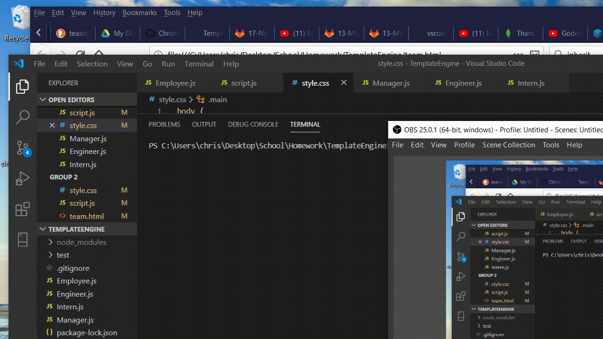

Team Profile Generator

Creates a html with each team member on  a separate card. Each card has the members name, role, and id. The manager card in addition has the office number, the engineer has a github account name, and the intern has their school name. All roles are classes that inherits from the employee class which contains all the common information, while having their own fields and methods. 

The script usess inquirer to prompt the user for information on team members. The managers information is prompt for first and is placed on the top of the html. The other members are entered in next but in no particular order. The script will keep prompting for the next person until the user selects the 'no' option.

Technologies: 
    inquirer, jest, node, and fs. 

Gif of functionality

